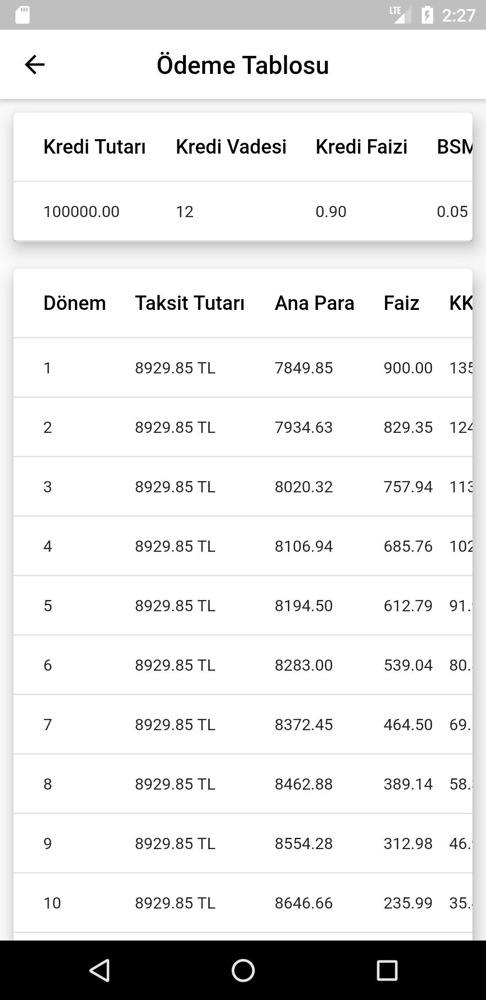
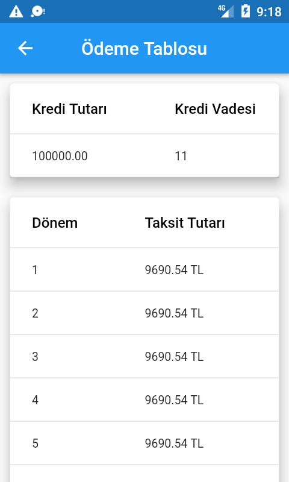
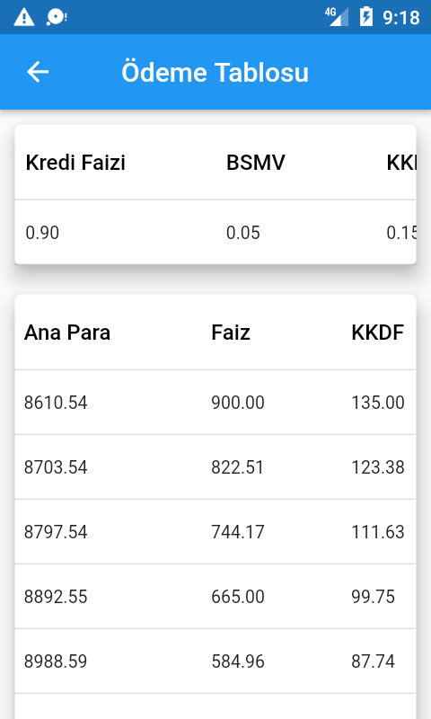
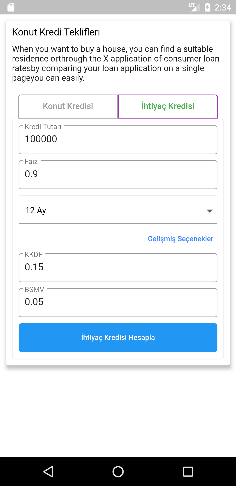

# flutter_loan_calculator

A new Flutter package which helps developers in creating loan calculator of their app.

## Screenshots

     

## Usage

[Example](https://github.com/eflatunyazilim/Flutter-Loan-Calculator/blob/master/example/lib/main.dart)

To use this package :

* add the dependency to your [pubspec.yaml](https://github.com/eflatunyazilim/Flutter-Loan-Calculator/blob/master/pubspec.yaml) file.

```yaml
  dependencies:
    flutter:
      sdk: flutter
    flutter_loan_calculator:
```

### How to use

```dart
class MyHomePage extends StatefulWidget {
  @override
  _MyHomePageState createState() => _MyHomePageState();
}

class _MyHomePageState extends State<MyHomePage> {

  String description = "Some description ..."
      "Some description ..."
      "Some description ..."
      "Some description ...";

  @override
  Widget build(BuildContext context) {
    return PaymentGenerator(
       description: description,
    );
  }
}
```


## Getting Started

This project is a starting point for a Dart
[package](https://flutter.dev/developing-packages/),
a library module containing code that can be shared easily across
multiple Flutter or Dart projects.

For help getting started with Flutter, view our 
[online documentation](https://flutter.dev/docs), which offers tutorials, 
samples, guidance on mobile development, and a full API reference.
"# Flutter-Loan-Calculator" 
